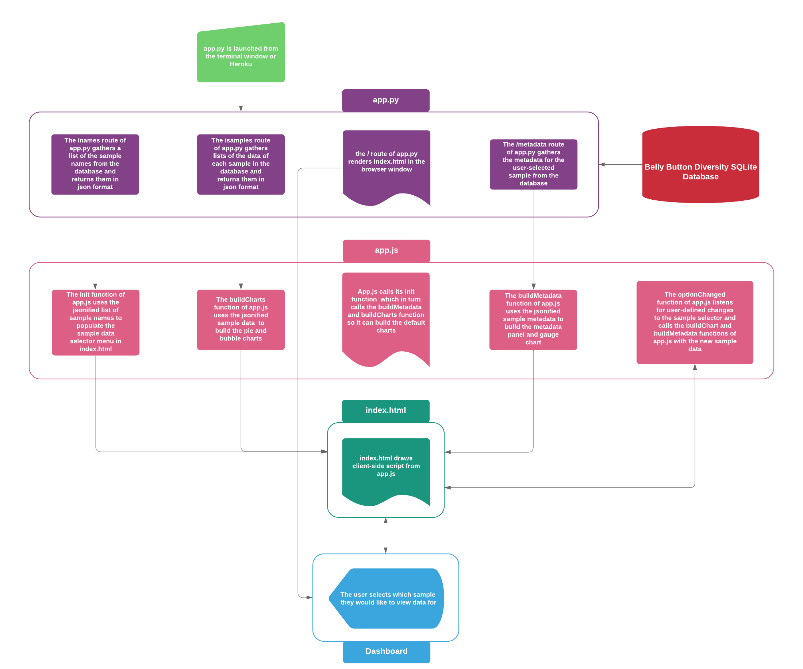

# Homework 12 The Belly Button Biodiversity app
*By Kylie Tan*

The purpose of this exercise was to first create an interactive dashboard that
would retrieve sample data from a database and display the selected sample's
metadata, as well as several charts depicting the sample data, and then to deploy the app using Heroku.

In order to build the app, three files needed to be created:

1. A Python file that would initialize the routes the app would need to retrieve sample data from the database, and allow the app to be called from a command line or Heroku.

2. A html file where the structure of the app's frontend would defined.

3. A JavaScript file that would interact with the front and back end elements in order to allow the database to be queried by the user for a specific sample's data, and for that data to then be displayed on the dashboard.

Here is a flow diagram that details the interaction between the various components of each of the aforementioned files and how they work in concert to bring the Belly Button Biodiversity app's interactive dashboard to life.

Belly Button Biodiversity App

